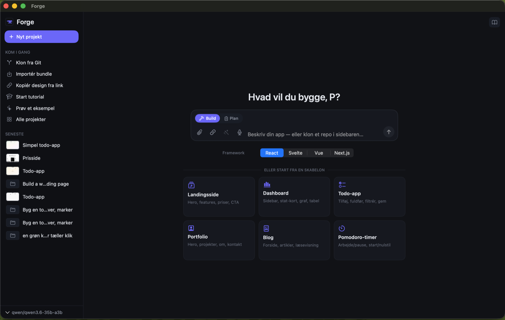
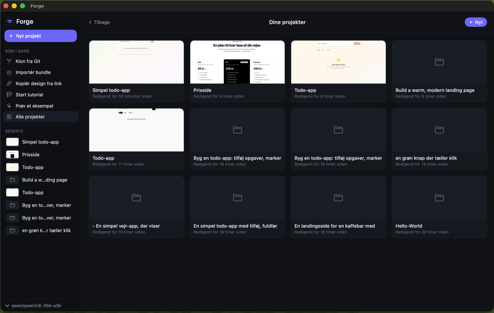
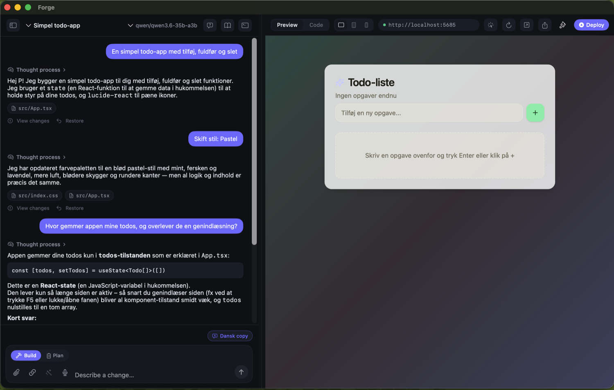
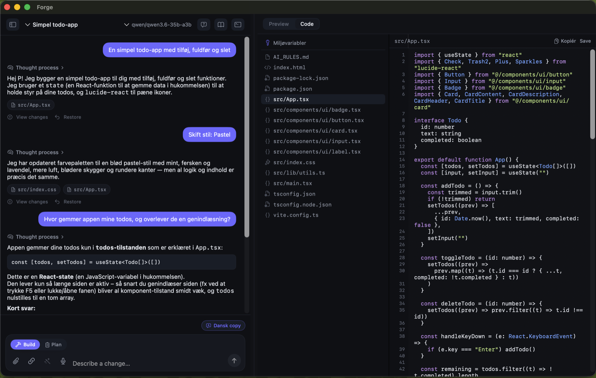
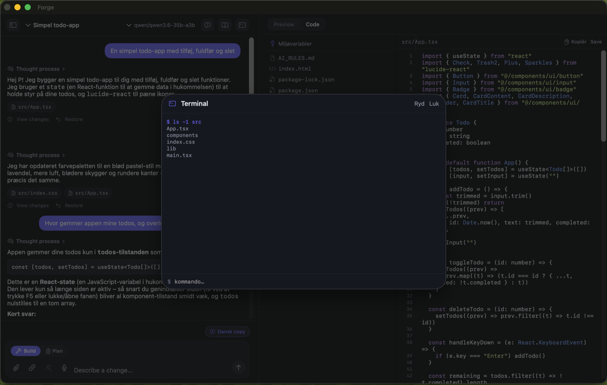
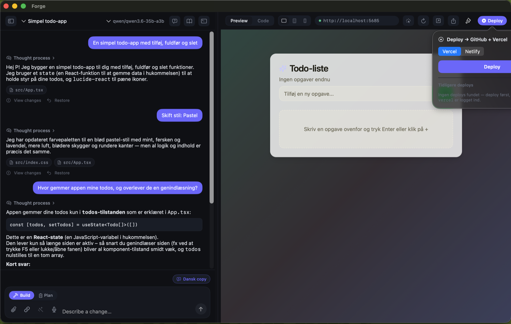
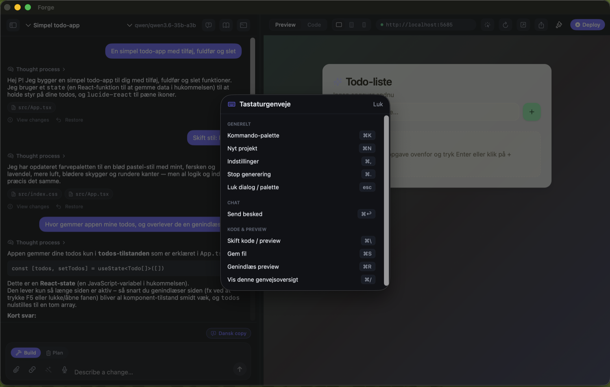

# Forge

**Local-first, open-source app builder for macOS** — a native SwiftUI take on the
Lovable.dev / Bolt.new pattern, except the model runs on *your* Mac and the code lands on
*your* disk. Type a prompt; an AI agent writes a real React / Svelte / Vue / Next.js
project, Forge installs it, runs the dev server, and shows a live preview with
hot-module-reload. No cloud account required, no code leaves your machine.



## Why Forge

- **Local-first & private.** Point it at [Ollama](https://ollama.com) or
  [LM Studio](https://lmstudio.ai) and the whole loop — prompt → generated code → preview
  — happens on-device. Your prompts and your source never leave the Mac.
- **Real files, not a sandbox.** Every project is a normal folder on disk you can open in
  any editor, commit to git, and run with `npm` yourself. Forge is a front-end to the same
  toolchain you'd use by hand.
- **Native, not Electron.** A genuine SwiftUI app with a `WKWebView` preview — fast cold
  start, low memory, proper macOS window/menu behaviour.
- **Bring your own model.** Local models for free/private work, or plug in a cloud API key
  (OpenAI, Anthropic, Google Gemini, NVIDIA) when you want a bigger model.

## Install

1. Download **`Forge-0.2.0.dmg`** from the
   [latest release](https://github.com/Parthee-Vijaya/forge-mac/releases/latest).
2. Open the DMG and drag **Forge** to **Applications**.
3. The build is ad-hoc signed (not yet notarised — that's deferred until a paid Apple
   Developer account is set up), so on first launch **right-click → Open** and confirm the
   prompt. After that it opens normally.

Requires **macOS 26** (Apple Silicon). You'll also want a model backend running — the
onboarding wizard helps you install one (see [Models](#models)).

## A guided tour

Forge guides you from an empty prompt to a deployed app. Here's the full loop.

### 1 · Start — describe what you want to build


The home screen is the launchpad. Type what you want in the prompt box ("*Hvad vil du
bygge?*"), or pick a starting point:

- **Build / Plan toggle** — *Build* generates straight away; *Plan* makes the agent draft
  a step-by-step plan and ask clarifying questions first, before writing any code.
- **Framework picker** — React, Svelte, Vue (all Vite) or **Next.js** (App Router). The
  agent scaffolds the chosen stack.
- **Template gallery** — one-click starters (Landing page, Dashboard, Todo, Portfolio,
  Blog, Pomodoro) so you're not staring at a blank prompt.
- **Get started rail** — clone from Git, import a shared bundle, or "copy a design from a
  link" to reverse-engineer an existing page.
- **Attach** images/screenshots or a reference link, or **dictate** the prompt by voice.
- The **active model** is always shown bottom-left.

### 2 · Dashboard — all your projects



Every build is saved as its own project. The dashboard shows them as a grid of live
thumbnails with "last edited" timestamps — click to resume exactly where you left off.
Projects can be renamed inline, duplicated, exported as a shareable bundle, or deleted
(with a confirm step).

### 3 · Build & preview — chat on the left, live app on the right



This is where the work happens. The agent streams its reasoning and edits on the left
while the **live preview** renders on the right against a local Vite/Next dev server with
hot-reload. The preview has browser-style chrome — a real URL bar
(`http://localhost:…`), reload, and a responsive-size selector. Keep iterating in the
chat box ("*Describe a change…*"); each turn is checkpointed so you can restore or diff
any previous state.

### 4 · Code — read and inspect everything the agent wrote



Flip the **Preview / Code** toggle to see the actual source. A file tree (keyboard-
navigable) sits next to a syntax-highlighted editor with line numbers and an active-line
highlight. You can watch files being written live as the agent works, copy any file, or
open the whole project in your editor / Finder.

### 5 · Terminal — drop down to the shell



A built-in terminal (`⌘T`) scoped to the project folder, for the moments you want to run a
command yourself — inspect `npm` output, add a package, poke at the dev server. Dev-server
logs and JS errors are captured per project so failures are easy to diagnose.

### 6 · Deploy — ship it



When it's ready, deploy straight from the toolbar. Targets include **Vercel**, **Netlify**
and **GitHub Pages**, plus push-to-GitHub. Deploy history is tracked per project, env vars
in your `.env` are pushed to the host, and you get a shareable live link back.

### 7 · Shortcuts — drive it from the keyboard



Press `⌘/` for the cheat sheet, or `⌘K` for the command palette. Everything has a
shortcut — new project, settings, stop generation, toggle code/preview, reload, terminal —
so you rarely need to reach for the mouse.

## Features at a glance

**Agent & engine**
- Streaming artifact parser with line-replace / diff edits (not just whole-file rewrites).
- Self-correcting agent loop: runs `tsc --noEmit` and a functional smoke test, then fixes
  its own type/build errors before handing back.
- Smart context management + a model-initiated *read-file* tool so the agent can inspect
  the project it's editing.
- Per-turn checkpoints (shadow git) with restore & diff.
- Chat-with-codebase (read-only RAG) — ask questions about the generated project.
- Pluggable agent backends and an **MCP server** (`forge-mcp`) that exposes a project to
  external agents.

**Workflow**
- Multi-framework: React / Svelte / Vue (Vite) + **Next.js** (App Router).
- Templates, Git clone, design-from-link, and import/export of shareable project bundles.
- Visual editing, "change the style/palette" injection, and a dependency UI for adding /
  removing npm packages.
- Command palette, full keyboard map, voice dictation (CanaryKit), toasts, token counter.
- Plan mode with structured follow-up questions before code is written.

**Platform**
- Native SwiftUI + `WKWebView`; reused WebView + process pool for fast cold start.
- Light / midnight-dark themes with a motion language of subtle micro-interactions.
- Resizable, persistent split panels.
- Optional HTTP status server to pair with an iOS companion.

## Models

Forge talks to whatever you have running. The onboarding wizard detects your hardware,
recommends a local coding model for your RAM tier, and can install **Ollama** or
**LM Studio** for you (official download or Homebrew) and pull the recommended model.

- **Local (free, private):** Ollama or LM Studio. Local models are called over the native
  chat endpoint so the context window (`num_ctx`) is set correctly rather than silently
  truncated.
- **Cloud (bring an API key):** OpenAI, Anthropic, **Google Gemini** (has a free tier), or
  NVIDIA NIM. Each provider has a one-click "get an API key" link in settings. Note: this
  is a developer **API key** from the provider's console — it is metered and separate from
  any chat subscription you may have.

Keys are stored in the macOS Keychain, never in plain text.

## Build from source

```sh
# Engine (pure Foundation Swift package — Command Line Tools is enough to build)
cd ForgeKit && swift build

# ForgeKit tests need the full Xcode toolchain
DEVELOPER_DIR=/Applications/Xcode.app/Contents/Developer swift test

# Generate the app project (Forge.xcodeproj is gitignored — regenerate after pulling)
xcodegen generate

# Build the macOS app
DEVELOPER_DIR=/Applications/Xcode.app/Contents/Developer \
  xcodebuild -project Forge.xcodeproj -scheme Forge -arch arm64 \
    ONLY_ACTIVE_ARCH=YES -derivedDataPath ./.build-xcode build

# Package a Release DMG (reads MARKETING_VERSION → Forge-<version>.dmg)
bash scripts/build-dmg.sh
```

Run `xcodegen generate` whenever new files are added to the **Forge** app target.
ForgeKit sources are globbed by SPM, so new files there don't need a regenerate.

## Layout

- **`ForgeKit/`** — the engine (Swift Package, pure Foundation, Swift 6 strict
  concurrency): model router, streaming artifact parser, action executor,
  process/dev-server manager, agent loop. Also ships `forge-mcp` (MCP stdio server).
  Builds and tests headlessly.
- **`Forge/`** — the SwiftUI macOS app: chat pane, code editor, `WKWebView` preview,
  terminal, onboarding, settings. Generated into `Forge.xcodeproj` via `xcodegen`.
- **`scripts/`** — `build-dmg.sh` and friends.
- **`docs/screenshots/`** — the images in this README.

## Status & caveats

Forge is an actively-developed personal project, feature-complete through its P2 backlog.
Known limitations:

- **Not notarised yet.** Ad-hoc signed; first launch needs right-click → Open. Notarisation
  is deferred until a paid Apple Developer account is in place.
- **Apple Silicon / macOS 26 only.**
- Cloud-deploy targets (Vercel/Netlify) require their respective CLIs to be installed and
  authenticated.
- The iOS companion is host-side only so far (an HTTP status server + menu toggle); the
  companion app itself is a separate, in-progress target.

See [HANDOFF.md](HANDOFF.md) and [ROADMAP.md](ROADMAP.md) for the full stack notes,
gotchas, and backlog.
